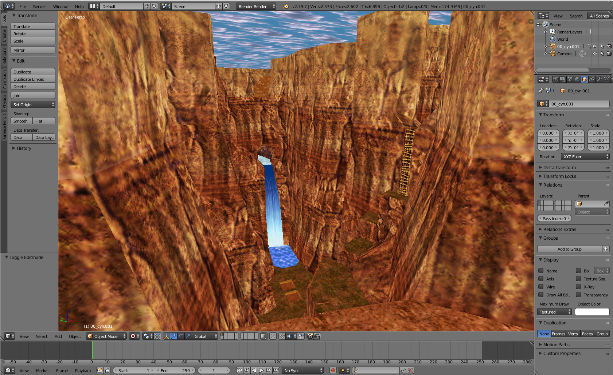

# Indiana Jones and the Infernal Machine Mod Tools
This repository contains command command-line tools: [**gobext**](programs/gobext), [**cndtool**](programs/cndtool) and [**matool**](programs/matool) for extracting and modifying game assets of the game Indiana Jones and the Infernal Machine.
Tools can be downloaded from [Releases](https://github.com/smlu/ProjectMarduk/releases) page.

If you need tools to edit `3DO` models and `KEY` animations use blender add-on: [blender-ijim](https://github.com/smlu/blender-ijim).  
To edit `MAT` texture files use gimp plugin: [gimp-ijim](https://github.com/smlu/gimp-ijim).

  

*(Canyonlands imported into Blender)*

## Content
  ### Libraries
  - [**libim**](libraries/libim) - C++ library for parsing and writing game resources (CND, GOB, MAT, KEY).

  ### Programs
  - [**cndtool**](programs/cndtool) - A multi-purpose command-line tool for CND level files. It can add, extract or replace `animation`/`texture`/`sound` game assets. Tool can also extract and convert the level geometry to [Wavefront OBJ](https://en.wikipedia.org/wiki/Wavefront_.obj_file) file format.  
  For more info see [README](programs/cndtool/README.md).

  - [**gobext**](programs/gobext) - A command-line tool for extracting all game resource files (e.g.: models, scripts, level files etc..) from `*.gob` files.  
  For more info see [README](programs/gobext/README.md).

  - [**matool**](programs/matool) - A command-line tool for editing and generating `MAT` texture files.  
  For more info see [README](programs/matool/README.md).

## Building from Scratch

### Prerequisites
  - [**git**](https://git-scm.com/) scm
  - [**CMake**](https://cmake.org/download/) >= 3.15
  - **C++17** supported compiler (gcc, clang, VisualStudio)

### Configure and Build
  1. Clone repository and dependencies:  
  ```
     git clone -b develop --recursive https://github.com/smlu/ProjectMarduk
  ```
  2. Move into directory `ProjectMarduk`:
  ```
     cd ProjectMarduk
  ```
  3. Make subdirectory `build`: 
  ```
     mkdir build
  ```
  4. Run cmake configure:
  ```
    cmake -DCMAKE_BUILD_TYPE=Release -B build
  ```
  5. Compile
  <pre>
  cmake --build build
  <i>Note: On Windows, when using <b>VisualStudio</b> to configure cmake you can
        open generated <b>*.sln</b> project in VisualStudio and compile it there.</i></pre>