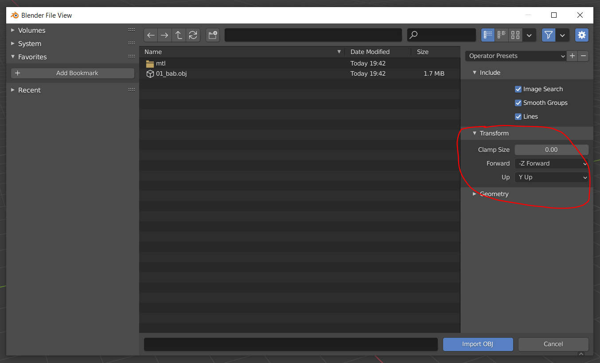
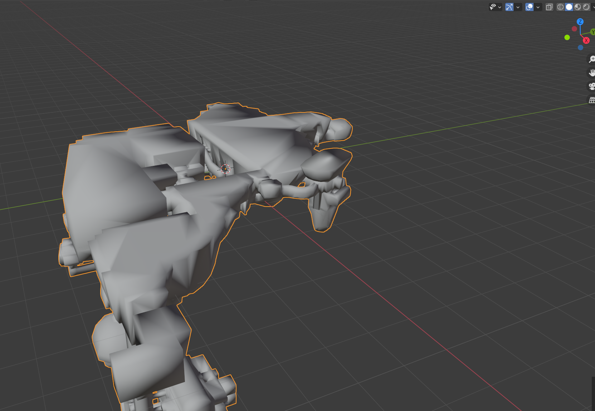
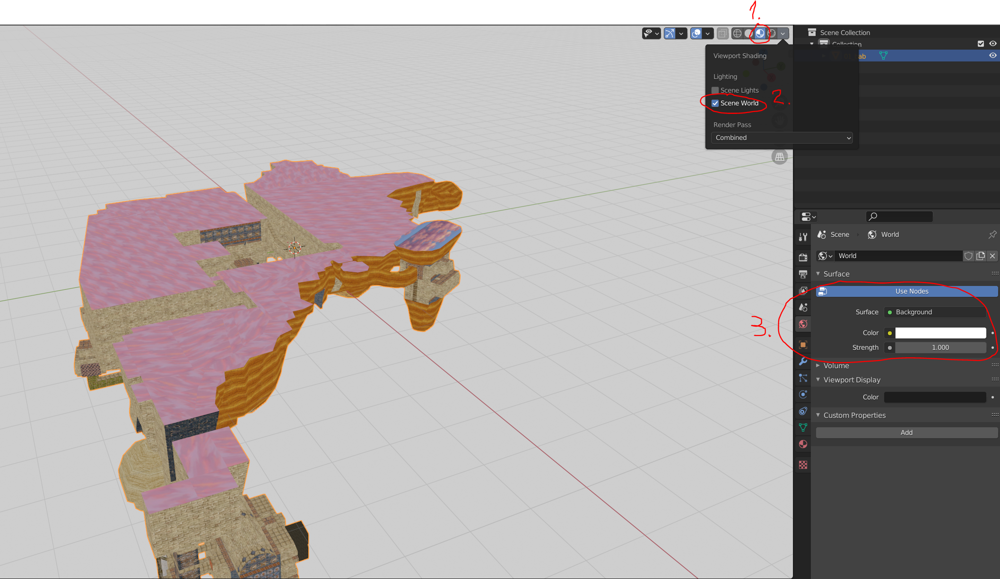
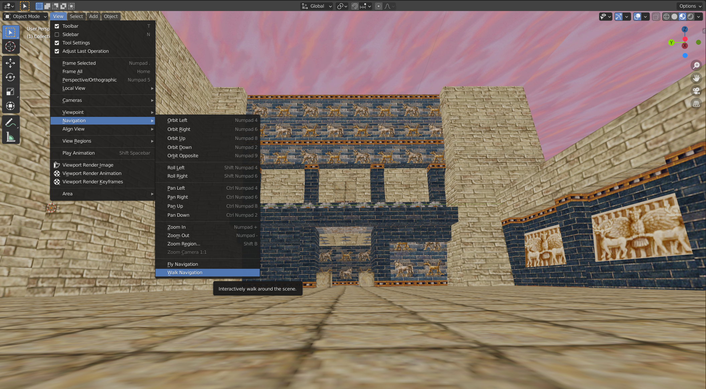
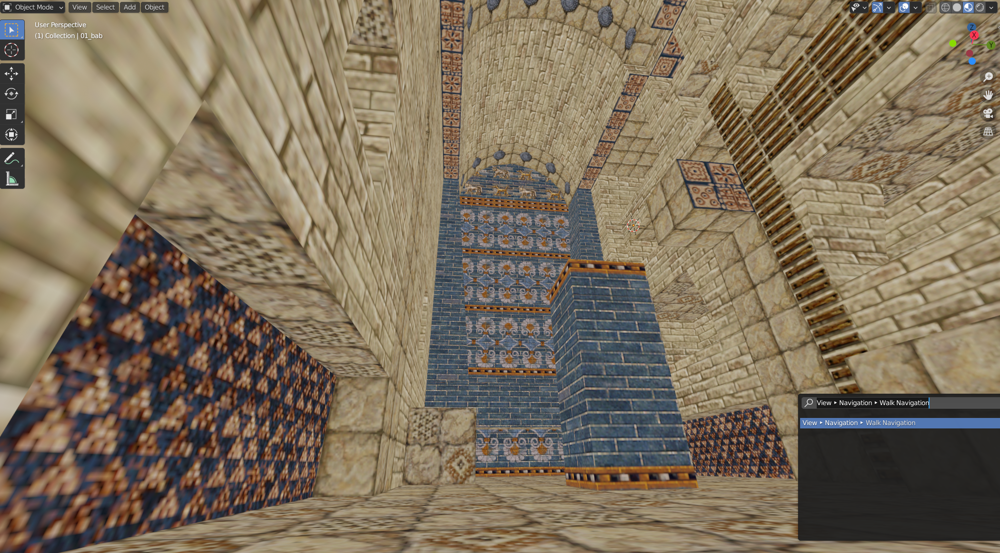
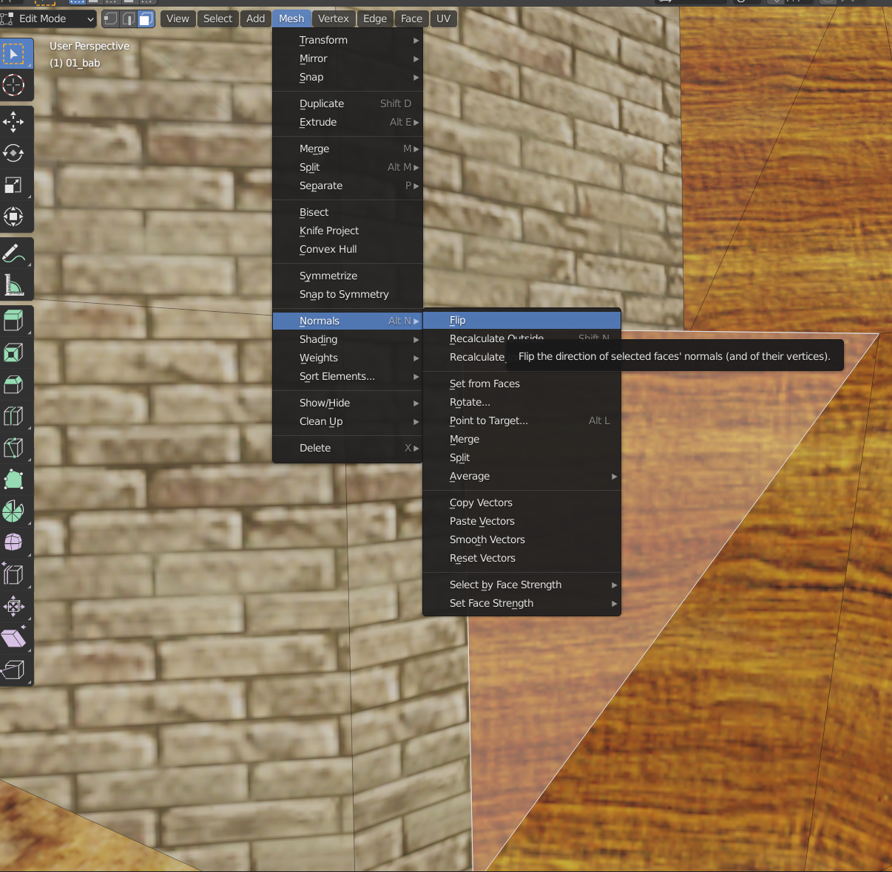

 # Tutorial convert CND to OBJ
 This tutorial will show you how to extract and convert a level geometry from **01_bab.cnd** file to [Wavefront OBJ](https://en.wikipedia.org/wiki/Wavefront_.obj_file) format and open it in [Blender](https://www.blender.org/download/) 2.80 and newer.  
 For Blender 2.79 see [cnd2obj_v2.79](cnd2obj_v2.79.md).

## Prerequisite
1. **cndtool** version `0.6` or greater
2. [Blender 2.80](https://www.blender.org/download/releases/2-80/) or newer.
3. Level file **01_bab.cnd**

## Convert CND to OBJ
Open a terminal (`cmd.exe` on Windows) and navigate to the `cndtool` folder.
Then execute following command:
<pre>
cndtool convert obj &#60path_to_01_bab.cnd&#62

<i>Note: If you want the output files to be placed in a specific folder add parameter <b>-o=&#60;output_folder_path&#62;</b>.</i>
</pre>

The command should take a few seconds to finish. After it completes, you should have **01_bab.obj** file and **mtl** folder in the output folder.

## Open OBJ in Blender
1. Open **Blender** and import **01_bab.obj**  
   Make sure the `Forward` axis is set to '`-Z`' and '`Up`' axis is set to '`Y Up`' in the `Transform` import option.

2. The imported level object will be rotated for 90 degrees on the `x` axis. We have to rotate it and set viewport shading to solid texture with backface culling:
 

    1\. Change the `Viewport shading` to `Material Preview`.  
    2\. Set lighting to `Scene World`.  
    3\. Set the `Surface` option in the `World Properties` to `Background` and set the color to white.  

3. Change the navigation mode to `Walk Navigation` then move around and inside of the level's object.  
Use the mouse to rotate and keys `W`, `A`, `S`, `D` to move around.
Use keys `Q` and `E` to move up/down.

4. Blender automatically calculates the face normal of the model surfaces. Some might point in the wrong direction when OBJ level is imported and you have to flip them manually. 
