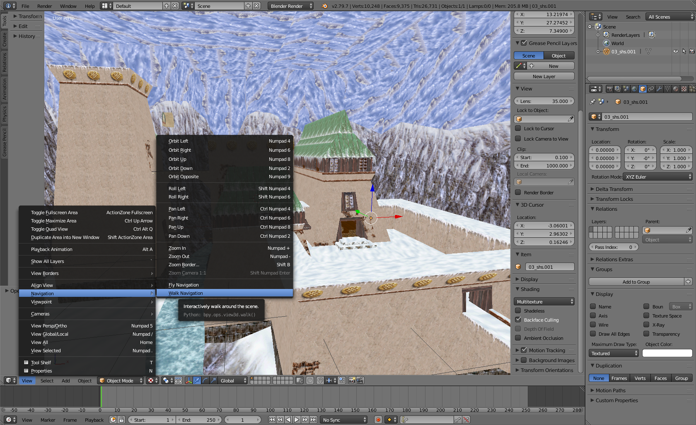

 # Tutorial convert CND to OBJ
 This tutorial will show you how to extract and convert a level geometry from **03_shs.cnd** file to [Wavefront OBJ](https://en.wikipedia.org/wiki/Wavefront_.obj_file) format and open it in [Blender](https://www.blender.org/download/).

## Prerequisite
1. **cndtool** version `0.5` or greater
2. [Blender 2.79](https://www.blender.org/download/releases/2-79/)
3. File **03_shs.cnd**

## Convert CND to OBJ
Open a terminal (`cmd.exe` on Windows) and navigate to the `cndtool` folder.
Then execute following command:
<pre>
cndtool convert obj &#60path_to_03_shs.cnd&#62

<i>Note: If you want the output files to be placed in a specific folder add parameter <b>-o=&#60;output_folder_path&#62;</b>.</i>  
</pre>

The command should take a few seconds to finish. After it completes, you should have **03_shs.obj** file and **mtl** folder in the output folder.

## Open OBJ in Blender
1. Open **Blender** and import **03_shs.obj**  

2. The imported level object will be rotated for 90 degrees on the `x` axis. We have to rotate it and set viewport shading to solid texture with backface culling:
 

    1\. Select the level object.  
    2\. Go to the object edit tab.  
    3\. Set `Rotation` on the `x` axis to 0 degrees.  
        *Note cndtool version 0.6 and newer sets correct OBJ coordinate system orientation and no rotation is needed here.*  
    4\. Click the "+"  sign in the top right corner of the viewport window (or press "`n`" on the keyboard) to open the `Transform` window. In the transform window, move down to `Shading` options and make sure the option `Backface Culling` is checked.  
    5\. Set viewport shading to `Texture`.  

3. Change the navigation mode to `Walk Navigation` then move around and inside of the level's object.  
Use the mouse to rotate and keys `W`, `A`, `S`, `D` to move around.  
Use keys `Q` and `E` to move up/down.  
*Note: Due to Blender automatically calculating face normals some normals might point in the wrong direction and you'll have to manually flip them.*
